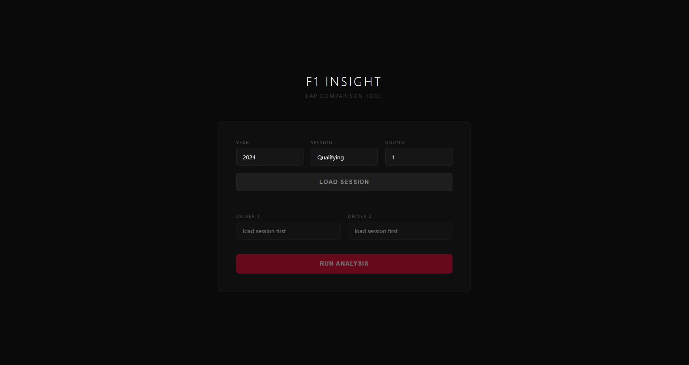

# F1 Insight — Lap Telemetry Comparison Tool

Interactive F1 lap telemetry analysis tool built in Python. Compare any two drivers across any session from 2018 to 2026 using real FastF1 data. Deployed live — no installation required.

**Live tool:** https://web-production-f0038.up.railway.app



---

## What it does

Select a year, session (Qualifying or Race), round number, and two drivers. The tool fetches real telemetry data and renders:

- **Speed** — overlaid traces for both drivers
- **Δ Time** — cumulative lap time delta reconstructed by integrating speed over distance, auto-scaled to the actual gap range
- **Throttle** — percentage application across the lap
- **Brake** — binary brake channel converted to percentage
- **Gear** — gear selection trace
- **Battery SOC** — 2026 sessions only (see below)
- **Animated GPS track map** — speed-coloured trace, corner numbers, real-time driver dot positions with z-order based on cumulative delta

---

## Pre-2026 mode

DRS activation zones are detected from the telemetry channel and overlaid in green across all panels. Shows exactly where each driver opened the wing and the speed response.

---

## 2026 mode

DRS does not exist under 2026 regulations. Instead the tool models MGU-K battery SOC.

**Deployment logic gates on three conditions simultaneously:**
- Throttle > 95%
- Speed > 200 km/h
- GPS curvature below normalised threshold

The curvature threshold is computed from the cross-product of the position gradient vectors of the GPS trace. This distinguishes straights from corners without any track-specific hardcoding — deploying mid-corner would generate rear torque asymmetry and is physically incorrect.

**Harvest:**
- Full harvest (33kW) under braking
- Partial harvest (30% of 33kW) during coasting

**Session-aware reserve:**
- Qualifying / Practice: 0% reserve — full deployment, use everything on the flying lap
- Race / Sprint: 15% reserve — charge retained for overtaking and defending

**Starting SOC:** 95% — teams charge on the out lap and bleed a small amount before the start/finish line.

---

## Tech stack

- Python 3
- FastF1
- Flask
- NumPy
- Pandas
- JavaScript Canvas API (rendering)
- Railway (deployment)

---

## Run locally
```bash
git clone https://github.com/emdiska/F1-Pitwall.git
cd F1-Pitwall
pip install -r requirements.txt
py main.py
```

Opens automatically at `http://127.0.0.1:5000`

---

## Project context

Built as part of a vehicle dynamics portfolio ahead of F1 placement applications. First year MEng Mechanical Engineering (Automotive), University of Bath.

Part of a wider set of projects including a TBRe suspension kinematics solver and a 2026 F1 laptime/energy deployment simulation.
